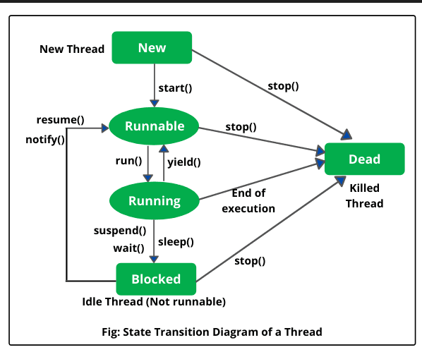

* TOC
{:toc}
AtomicReference

## 목적
Spring Mvc 프로젝트에서 멀티스레드가 접근하는 변수의 Atomic Operations 해보기.

## 개요
Spring Mvc 기반의 프로젝트에서 AtomicReference를 사용하기에 앞서 syncronized와 CAS 방식의 차이를 알아보고 더 효율적인 방식인 AtomicReference를 이용하여 멀티스레딩 상황에서의 원자적 연산을 해보겠다.

## syncronized
syncronized 키워드를 사용해 블록을 형성하거나 메서드에 선언해두면 하나의 스레드의 실행을 보장할 수 있다.  
syncronized 블록은 다른 스레드가 블록 안으로 들어오는것을 막게되고 이 스레드들은 block된다.  
java에서는 monitor를 통해 스레드를 획득하게 되는데, 스레드가 blocked 상태로 변경되고 다시 resume 되는 것은 비용이 비싸다.  

### 스레드의 상태 전이


## Atomic Operations
CAS(Compare-and-swap) 작업을 의미한다.

## CAS vs syncronized(thread locking 방식)
CAS는 현재 읽은값과 비교값이 다르면 계속 변경을 시도한다. 이러한 상황에서 스레드는 이론적으로 busy-wait 상태이고 cpu의 thread는 계속해서 비교를 시도할 것이다.  
반면, syncronized를 사용할 때는 thread locking이 되는데 이때는 운영체제에 의해 blocked 상태가 된다. notify()를 통해 운영체제에서 다시 runnable 상태가 된다. 이는 context-switching을 의미한다.

## AtomicReference SpringBoot 에서 사용해보기
AtomicReference 초기화는 타입파라미터로 LocalDatetime을 넣어준 뒤 스프링에서 관리되는 Bean의 전역변수로 생성했다.  
아래의 코드에서 asyncMethod()는 5초마다 실행하게 된다. ``@Async`` 어노테이션을 사용하면 메서드 내부의 동작이 5초 이상 걸리게 되면 5초 뒤에 실행되기로 한 메서드의 실행이 되지 않게 된다.  
지정한 시간에 실행하고 있는 스레드가 작업 중이어도 별도의 스레드를 통한 메서드 실행을 위해 ``@Async``를 붙여줌으로써 별도의 스레드를 통한 동작이 가능하게 된다.    
이제 전역변수를 여러개의 스레드가 동시에 접근할 수 있는 상황이 되었다.  
멀티스레딩에서의 전역변수 값을 캐시값으로 참조하게 되는 가시성과 스레드간의 값을 덮어씌우게 되는 동시접근 이슈를 해결할 수 있는 방법으로 jdk의 AtomicReference를 이용하여 LocalDatetime을 업데이트해보겠다.  
아래 예시에서는 TypeParameter를 LocalDatetime으로 지정했는데, TypeParameter에는 LocalDateTime 뿐만 아니라 어떠한 객체타입이라도 모두 가능하다.
```java
import java.util.concurrent.atomic.AtomicReference;
import org.springframework.scheduling.annotation.Async;
import org.springframework.scheduling.annotation.Scheduled;

@Component
public class Schedule {
    private final AtomicReference<LocalDateTime> prevTime = new AtomicReference<>();

    @Scheduled(fixedRate = 5000)
    @Async
    public void asyncMethod() {
            LocalDateTime periodStart = parseDate(migFromDate);
            LocalDateTime periodEnd = periodStart.plusDays(1);
            if(prevTime.get() != null) {
                periodStart = prevTime.getAndSet(periodStart.plusDays(1));
                if(periodStart.equals(parseDate(migToDate))) return;
                periodEnd = periodStart.plusDays(1);
            }
    }
}
```
참고
- <https://velog.io/@chullll/JAVA-Atomic-%EA%B3%BC-%EB%8F%99%EC%8B%9C%EC%84%B1>(java atomic 활용)
- <https://stackoverflow.com/questions/68959187/confusion-on-atomicreference-getandupdate>(getandupdate vs getandset)
- <https://stackoverflow.com/questions/2664172/java-concurrency-cas-vs-locking>(CAS와 스레드 locking의 속도 비교글)
- <https://stackoverflow.com/questions/26541119/whats-different-between-the-blocked-and-busy-waiting>(busy-waiting vs blocked)